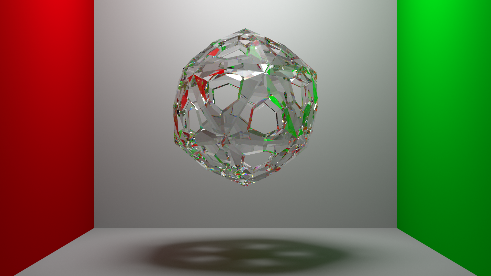

# Rog:

Rog is a spectral path tracer written in rust.

## Example renders


The scene above includes models from Stanford university and Poly Haven.


## Usage

To run the renderer, use the following command:

```bash
cargo run --release -- --file <PATH TO SCENE FILE>
```

## Scene files

Currently the renderer only reads scenes from glTF files (.glTF or .glb).
It supports most features of the format, with the exception of animations and rigging.
The next section describes custom properties that may be used to specify properties that glTF does not natively support.

### Custom glTF properties

- Lights:
    - All
        - spectrum: relative path to a csv with two columns; wavelength and relative intensity. The spectrum is normalized to unit luminance for the CIE 1931 standard observer.
    - Point
        - radius: meters as float - default: 0.0
    - Directional
        - angular_diameter: degrees as float - default: 0.0
- Materials:
    - Cauchy's law coefficients for the material, if not provided an approximation based on IOR is used.
        - cauchy_a: A coefficient as float
        - cauchy_b: B coefficient as float
- Node named 'background':
    - intensity: background light's intensity as float - default: 1.0
    - spectrum: relative path to a csv with two columns; wavelength and relative intensity. The spectrum is normalized to unit luminance for the CIE 1931 standard observer.
    - rgb: hexadecimal rgb color


#### License

<sup>
Licensed under either of <a href="LICENSE-APACHE">Apache License, Version
2.0</a> or <a href="LICENSE-MIT">MIT license</a> at your option.
</sup>